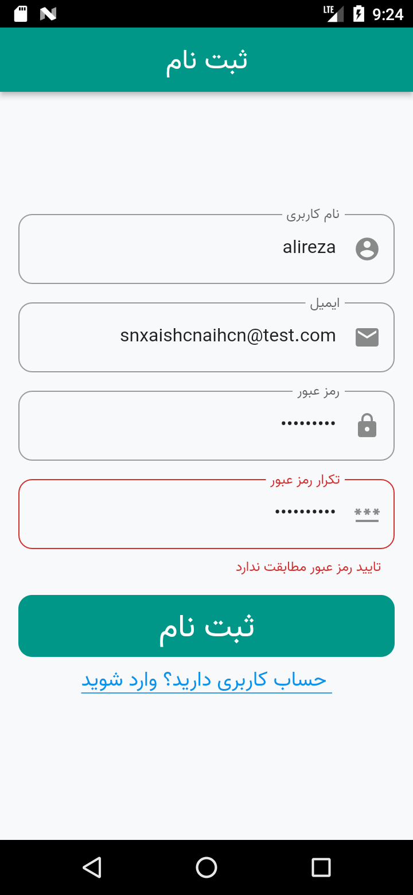
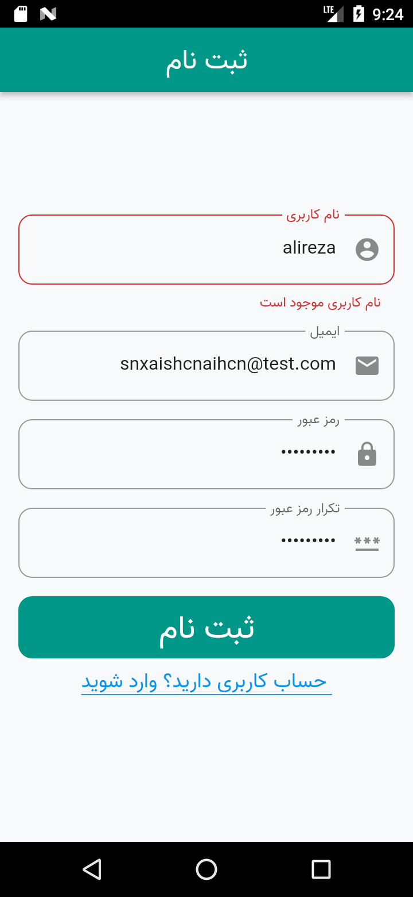
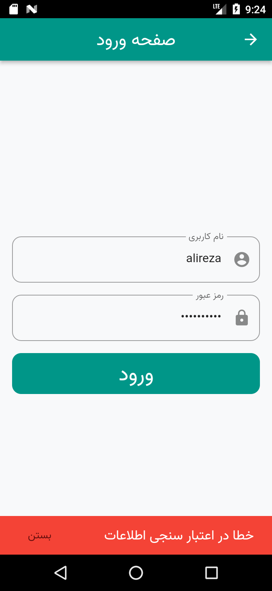
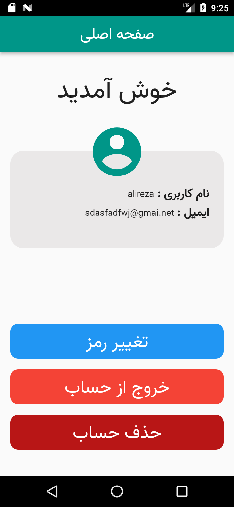
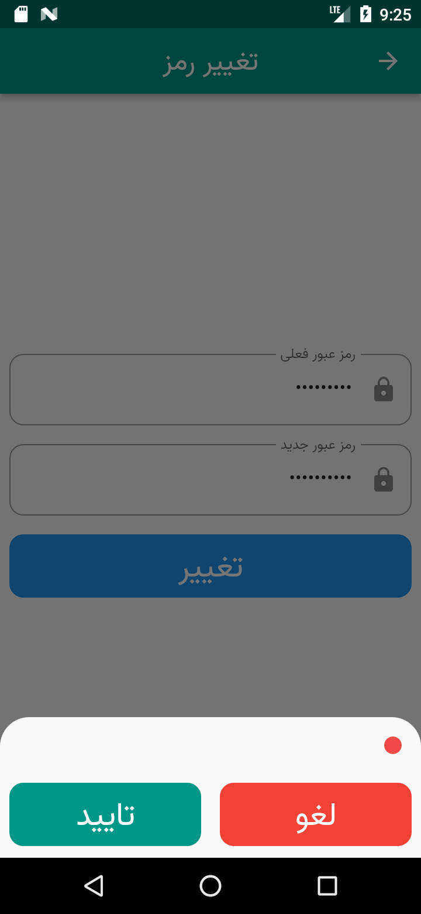
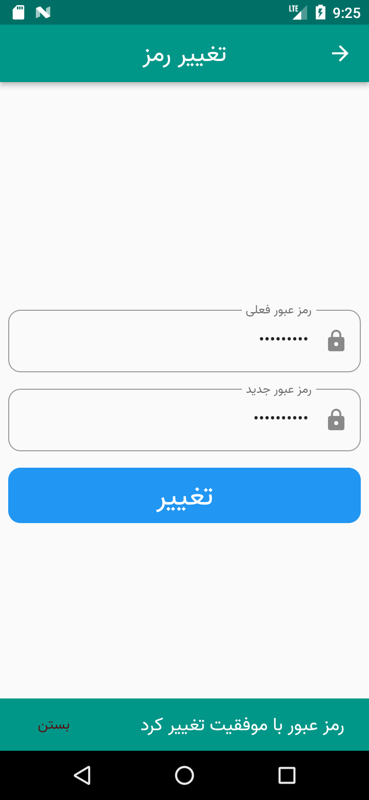
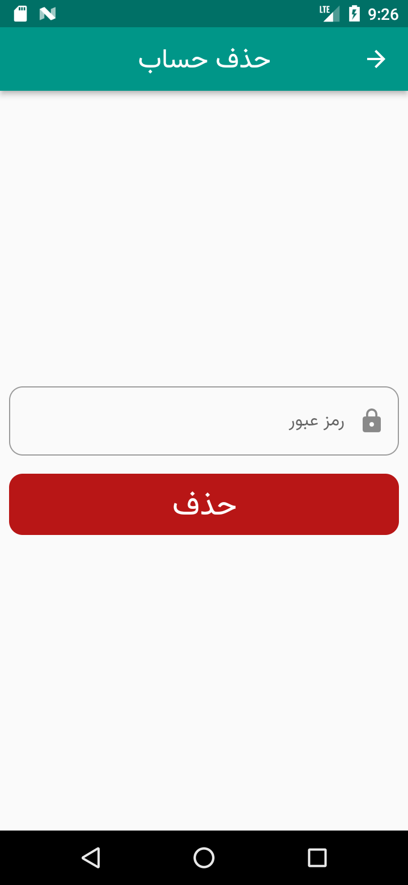
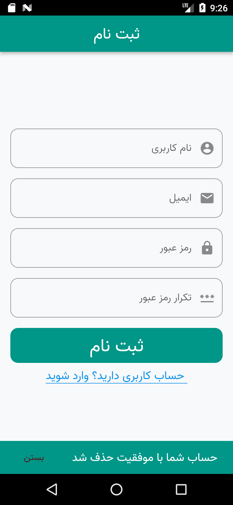

 

<h1>احراز هویت با فلاتر و لاراول</h1>
  <h2>پروژه احراز هویت در اپلیکیشن با استفاده از فلاتر و لاراول</h2>
  <h3>شامل  :</h3>
  

- بخش ثبت نام کاربر
- بخش ورود کاربر
- اعتبار سنجی با توکن
- امکان محدودیت ثبت نام با ip
- امکان تغییر رمز حساب کاربری
- امکان خروج از حساب کاربری
- امکان حذف حساب کاربری
- دریافت اطلاعات کاربر و ذخیره در لوکال دیتابیس Hive
- استفاده از provider
- استفاده از Hive
- استفاده از http
- و ...
  
<h3>تصاویر اپلیکیشن  :</h3>

 
 
 
 

 

 
 

 
 
 
 

 

 
  

 
 
 

 

 
<h2>توجه !</h2>
 <h5>قطعا این پروژه همانند خیلی از پروژه های دیگر خالی از اشکال نیست.در صورت امکان با گذشت زمان بعضی از نواقصات و مشکلات رفع خواهد شد.</h5>
 <h5>در صورت تمایل میتوانید در توسعه و خطایابی این پروژه همکاری کنید.</h5>
 <h5>این پروژه بیشتر جنبه تمرینی و آموزشی دارد.</h5>
 <h6>تمامی مسئولیت ها در قبال هرگونه استفاده از این پروژه و محتویات آن بر عهده خود فرد می باشد.</h6>
 
<h2>اطلاعات توسعه دهنده</h2>
- ایمیل :  a.hassanzadeh8115@gmail.com
   
- تلگرام  : @AmirzCode

